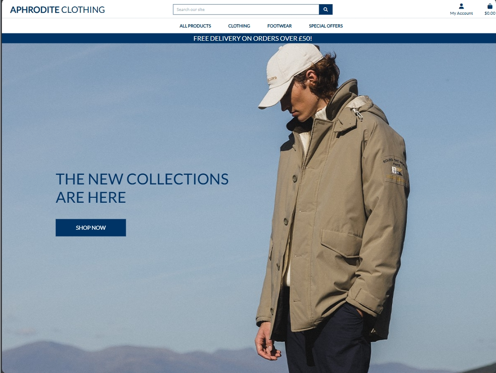
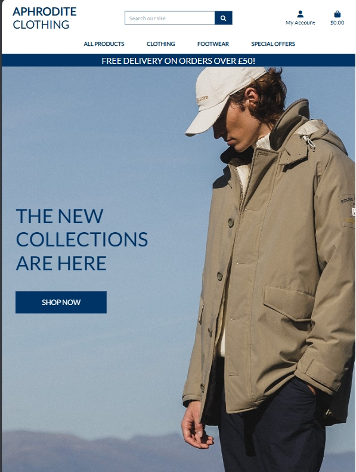
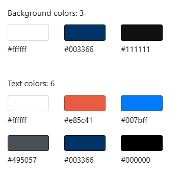
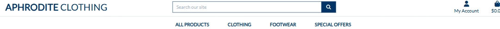
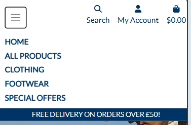
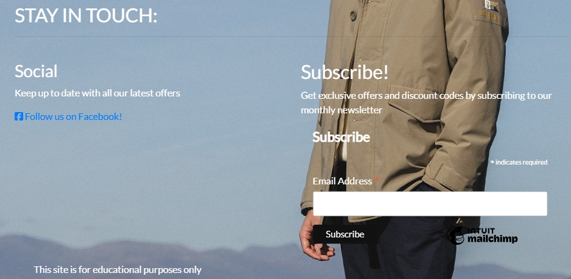

# [Aphrodite Clothing](https://aphrodite-clothing-brian-mc-c3a3e25ecbf0.herokuapp.com/)

 A responsive web application for Users to view and buy items from a clothing store.

**Code Institute - Milestone Project 4**

HTML / CSS / Jquery / Python / Jinja2 / Flask / MySQL / Stripe

By Brian McAnaney






[View Live Deployment](https://aphrodite-clothing-brian-mc-c3a3e25ecbf0.herokuapp.com/)

## Strategy

### THE 5 PLANES

- **Purpose of the website?**

    Provide a platform for customers to view and buy clothing.

- **Target audience?**

    * Customers: People who would like to buy items for themselves.

    * Potential: those who may want to buy for themselves at a later date or to buy for someone else.

- **Value to the user?**

    * Recommendations: each item has a rating which helps with potential purchase decisions.

    * Convenience: Users can shop from the comfort of their homes, avoiding the hassle of traveling to physical stores.

    * Price Comparison: Users can easily compare prices across different websites to find the best deals.

- **What makes a good experience ?**

    * User-Friendly Interface: A well-designed and intuitive interface that is easy to navigate, ensuring that users can find and view different items.

    * Responsive Design: A website that adapts seamlessly to various devices and screen sizes, ensuring a consistent and enjoyable experience whether users are on desktop, tablet, or mobile.

    * Accessibility: Ensuring that the website is accessible to users with disabilities, including features like alt text for images and keyboard navigation.


- **What we shouldn't do?**

    * Spam or Over-Promotion: We do not engage in spammy practices, including excessive advertising, unsolicited emails, or intrusive pop-ups that disrupt the user experience.

    * Plagiarism: We do not plagiarize content from other sources. All content on our platform is original, properly attributed, and respects copyright laws.

    * Neglecting User Privacy: We do not compromise user privacy by sharing or selling personal information without consent. We adhere to strict privacy policies to protect user data.

### The Why

To help the business gain more custom, to provide users with a place to read honest reviews, and to help them with their choices.

### The Business Goal

## Business Goal

Our primary goal is to create a user-friendly online platform that offers a wide range of high-quality clothing and accessories. We aim to provide competitive pricing and excellent customer service. Our mission is to become a trusted and preferred destination for fashion enthusiasts, driving sales growth and building long-term customer loyalty.


## UX
### Color Scheme

- Here are the colors chosen, I believe they have a good contrast to the hero image and background colors. They are also uniformed throughout the site.


    
### Typography

- I have chosen the "sans-serif" font and "Lato" as I believe it suits the layout of the website and simple style the website is going for. The back-up font is Times New Roman.


### Imagery

* Imagery is very important to the website as the site needs to show off the clothing and be appealing for people to come and visit and buy from the site.

* The pages will be consistent with the same fonts and colors in the contents of the pages. They will also have the same navbar and footer.

### Icons

* I used icons from Font Awesome to encourage users to click on certain buttons and to add a clear visual indicator of where to click.

## Structure

### Information Architecture

* I used a similar layout to the Boutique Ado example in the Code Institute course as I believed it would suit the layout of my hero image and website as a whole. The website has a Homepage, then further pages for items of clothes, login/register and a checkout.
  - Homepage - Large hero image showing an item of clothing. it also has a button to go to other items.
  - All Products - This will have sub-sections / pages where you can view ALL items but in different orders, for example raing or price.
  - Clothing - This will have sub-sections / pages where you can view the items classed as clothes but in different orders, for example type of clothing (jeans, coats).
  - Footware - This will have sub-sections / pages where you can view the items classed as footware but in different orders, for example type of footware( trainers).
  - Login / Register - Simple page with matching colors to allow people to register or sign up.
  - Checkout / Bag - Simple page using Stripe and JS to allow purchases.

## User Stories

- **First-Time User Goals**

    - Enjoy a User-Friendly Experience: A user-friendly interface and navigation system that allows users to easily explore the website and discover items of clothing.


- **Returning User Goals**

    - Account Management: Allow users to easily manage their account details, order history, and preferences..

    - Smooth Navigation: Maintain an intuitive and user-friendly interface that makes it easy for users to find what they're looking for.

- **Website Owner Goals**
   
    - Revenue: Create a revenue stresam throuogh possible advertising.

    - Sign ups: If a user registers for an account they are more likely to come back.


## Wireframes
The basic layout of Aphrodite Clothing was created with [Balsamiq](https://balsamiq.com/).


## Features

### Existing Features

 - **Navigation Bar**
    - The navigation bar is a central feature that enhances the user experience by providing easy access to key functionalities and content.  Whether on a desktop or a mobile device, users can seamlessly navigate through the application with the help of this feature.

    -  Depending on the user's role and session status, the Nav Bar & Dropdown provide a set of relevant links for easy navigation

    - The Naviagtion bar was created with [Materialize](https://materializecss.com/)





 - **Footer Bar**
  - The Footer includes the social media links for the website.
  - Social media links open in a new page.
  - The Footer remains consistent on all pages.
  - Has a Mailchimp platform to provide users to subscribe for more info




- **Log In and Sign Up**
    - I added a Sign up Feature so users can provide their own details, for example address and payment details.

    - Users that are Signed Up and Logged in can edit their personal informaton.


## **DATABASES**
In this application, I rely on [MySQL](https://mysql.com/) as the primary database management system. MySQL is an open sourced database that allows us to store and manage data in a format that seamlessly fits the dynamic nature of our project. It plays a crucial role in storing user information, reviews and other essential data.


### CRUD Functionality

- **User Management:**
1. **Create User (C):**
   - Description: Allows users to register by providing necessary information. Includes checks for:
     - Matching passwords
     - Existing username

    - HTTP Method: POST

    - Database Operation: Inserts new user document into the "users" collection.

2. **Read User (R):**
    - Function: 'autheticate_user'

    - Description: Authenticates a user based on their username and password.

    - HTTP Method: N/A(Called within the sign_in route)

    - Database Operation: Reads user information to verify credentials.


2. **Sign In (R):**
    - Function: 'sign_in'

    - Description: Allows users to sign in by providing their credentials. Includes checks for:
        - Incorrect username or password

    - HTTP Method: GET and POST

    - Database Operation: Calls authenticate_user to validate user credentials.

3. **Log Out:**
    - Description: Allows users to log out of their accounts.

    - HTTP Method: GET

    - Database Operation: N/A 

    The log out function works by removing the users session cookie (session.clear).


## **TESTING**

For the documentation of all testing,Please see [TESTING.md](TESTING.md) 

## DEPLOYMENT
### Local Deployment
This project can be cloned or forked in order to make a local copy on your own system.

#### Cloning

You can clone this repository by following these steps:

1. Go to the [GitHub repository](https://github.com/brianmcananey/milestone-project-4) 
2. Locate the Code button above the list of files and click it 
3. Select if you prefer to clone using HTTPS, SSH, or GitHub CLI and click the copy button to copy the URL to your clipboard
4. Open Git Bash or Terminal
5. Change the current working directory to the one where you want the cloned directory
6. In your IDE Terminal, type the following command to clone my repository:
        - `git clone https://github.com/brianmcananey/milestone-project-4`
7. Press Enter to create your local clone.

Alternatively, if using Gitpod, you can click below to create your own workspace using this repository.

[](https://github.com/brianmcananey/milestone-project-4)

Please note that in order to directly open the project in Gitpod, you need to have the browser extension installed.
A tutorial on how to do that can be found [here](https://www.gitpod.io/docs/configure/user-settings/browser-extension)

#### Forking

By forking the GitHub Repository, we make a copy of the original repository on our GitHub account to view and/or make changes without affecting the original owner's repository.
    
You can fork this repository by using the following steps:

1. Log in to GitHub and locate the [GitHub Repository](https://github.com/brianmcananey/milestone-project-4)
2. At the top of the Repository (not top of page) just above the "Settings" Button on the menu, locate the "Fork" Button.
3. Once clicked, you should now have a copy of the original repository in your own GitHub account!

#### Running Locally

After you have cloned or forked the repository and navigated to the project directory, you can set up your local environment as follows:

1. **Install Dependencies**: Make sure you have Python 3.x installed on your system. Then, install the required dependencies listed in the `requirements.txt` file:

    ```  
    pip install -r requirements.txt
    ``` 

2. **Configure Environment Variables**: If your application requires environment variables, create a `.env` file in the project directory and add the necessary variables.

3. **.gitignore File**: Ensure that you have a `.gitignore` file in your project to exclude sensitive information and files from being committed to version control. Common entries in a `.gitignore` file include `.env`, `.pyc` files, and other temporary or generated files.

4. **Run the Application**: Start the local development server using the following command:

    ```
    python3 app.py
    ```

Replace `app.py` with the actual name of your main application file.

### Deployment with Heroku

This application can be deployed on Heroku to make it accessible on the web. Follow these steps to deploy your app:

#### Prerequisites

Before deploying the app on Heroku, make sure you have the following prerequisites:

1. [Heroku Account](https://signup.heroku.com/) - You need a Heroku account to deploy your app.
2. [Heroku CLI](https://devcenter.heroku.com/articles/heroku-cli) - Install the Heroku Command Line Interface to interact with Heroku from your terminal.

#### Deployment Steps

1. **Login to Heroku**: Open your terminal and log in to your Heroku account using the following command:
   
    ```
    heroku login
    ```
    Follow the prompts to log in to your Heroku account.

2. **Create a Heroku App**: Navigate to your project directory in the terminal and create a new Heroku app
    ```
    heroku create your-app-name
    ```
    Replace your-app-name with a unique name for your app. Heroku will provide you with a URL for your app (e.g., https://your-app-name.herokuapp.com/).

3. **Configure Environment Variables**: Store sensitive information like secret keys and API credentials as environment variables on Heroku. You can set these variables using the Heroku CLI or through the Heroku Dashboard
    ```
    heroku config:set SECRET_KEY=your-secret-key
    heroku config:set API_KEY=your-api-key
    ```
    Replace your-secret-key and your-api-key with the actual values you need to configure.

4. **Deploy to Heroku**: Deploy your app to Heroku by pushing your code to the Heroku remote repository
    ```
    git push heroku main
    ```
    Ensure that you have committed all your changes to the main branch before running this command.

5. **Open the App**: Once the deployment is complete, you can open your app in your web browser using the following command.
    ```
    heroku open
    ```
    This will open your app in a new browser window.

### Local vs Deployment

When working with this project, it's important to understand the differences between running the application locally and deploying it to Heroku:

- **Local Development**: Running the application locally is ideal for development and testing purposes. You can make changes, test new features, and experiment with the code in a controlled environment.

- **Heroku Deployment**: Deploying the application to Heroku makes it accessible to a wider audience on the web. It's suitable for sharing your project with others and providing a public URL for access.

Choose the deployment option that best suits your needs and project goals.

Always follow the steps and ensure that your sensitive information(API Keys, Database credentials, etc) are not visible to the public.


### Amazon AWS S3

This project uses Amazon Web Servies (AWS https://aws.amazon.com/) to store static and media files.

Once youve created an AWS account and logged in. You can follow the following steps to setup your static and media files storage.

From the AWS Management Console.

  - Search for S3
  - Create a new bucket, give it a name matching your Heroku app name and choose a region closest to you
  - Uncheck Block all public access and acknowledge that the bucket will be public.
  - From Object ownership make sure ACLs are enabled and Bucket owner preferred is selected
  - From the Permisssions tab paste in the following CORS configuration

  ```
    [
  {
      "AllowedHeaders": [
          "Authorization"
      ],
      "AllowedMethods": [
          "GET"
      ],
      "AllowedOrigins": [
          "*"
      ],
      "ExposeHeaders": []
  }
]

  ```

  - Copy your ARN string
  - From the Bucket Policy tab, select the Policy Generator link and set
    - Policy type: S3 Bucket Policy
    - Effect: Allow
    - Principal *
    - Actions: GetObject()
    - Amazon Resource Name (ARN): paste your ARN here
    - Click add Statement
    - Click Generate Policy
    - Copy entire Policy and paste it into the Bucket Policy editor

    ```
    {
    "Version": "2012-10-17",
    "Id": "Policy1726973504037",
    "Statement": [
        {
            "Sid": "Stmt1726973489892",
            "Effect": "Allow",
            "Principal": "*",
            "Action": "s3:GetObject",
            "Resource": "arn:aws:s3:::bucket name/*"
        }
    ]
    }
    ```
    
    - Click save
    - From the Access Control List (ACL) section click edit and enable List for Everyone (public access) and accept the warning box.

  ### IAM
  
  Back on the AWS service menu, search for IAM (Identity and access management). Once on the IAM page

  - From User Groups click Create New Group
  - From User Groups, select newly created group and go to the permissions tab
  - Open the Add Permissions dropdown and click on Attach Policies
  - select the policy then click on Add Permissions at the bottom
  - From the JSON tab select Import Managed Policy link
    - Search for S3 select AmazonS3FullAccess policy and import
    
    ```
    {
    "Version": "2012-10-17",
    "Statement": [
        {
            "Sid": "Statement1",
            "Effect": "Allow",
            "Action": [
                "s3:*"
            ],
            "Resource": [
                "arn:aws:s3:::bucket name",
                "arn:aws:s3:::bucket name/*"
            ]
        }
    ]
    }
    ```

    - Click Review Policy
    - Provide a description a brief overview of what it for
    - Click Create Policy 

  - From User Groups click on group created
  - Click Attach Policy
  - Search for ther policy youve just created select it and click on Attach Policy
  - From User Groups click Add User
  - From Select AWS access type select Programmatic Access
  - Select the group to add to your user (created above)
  - Click Create User
  - under the User Summary on the right click on Create Access Key
    - set AWS_ACCESS_KEY_ID = Access Key ID
    - AWS_SECRET_ACCESS_KEY = Secret Access Key
  
### Final Setup
  - Back within S3 buckets create folder media
  - copy over existing media files to this folder
  - Under Manage Public Permisssions select Grant public read access to this object


## Credits

### Content
 - All worded content was originally creating by myself and then edited and improved with suggestions from [Chat GPT](https://chat.openai.com/).

### Media
- All Icons Used were from [Font Awesome](https://fontawesome.com/)


- **Images**
    
   - all images sourced from Google images.

### Tools & Technologies Used
- [HTML](https://en.wikipedia.org/wiki/HTML)  is the backbone of web content. It defines the structure and content of the web pages.
- [CSS](https://en.wikipedia.org/wiki/CSS) used to control the visual presentation of the web application. It defines the layout, colors, fonts etc.
- [JavaScript](https://www.javascript.com) is a client-side scripting language that enhances user interactivity on the web pages.
- [Python](https://www.python.org/) is a versatile programming language commonly used for server-side development. It powers the logic and data processing of the web application.
- [Jinja](https://jinja.palletsprojects.com/en/3.1.x/) Is a Python-based templating engine used to dynamically generate HTML content by inserting data into predefined templates.
- [Materialize](https://materializecss.com/) Is a responsive front-end  framework and was used for many of the app's features.
- [Cloudinary](https://cloudinary.com/) is a cloud-based service for uploading, storing, optimizing, and delivering media assets such as images and videos.
- [MySQL](https://mysql.com/) is a database used for storing and managing structured data.
- [Git](https://git-scm.com) used for version control. (`git add`, `git commit`, `git push`)
- [GitHub](https://github.com) used for secure online code storage.
- [Heroku](https://heroku.com) To create and Host the Deployed App.
- [Balsamiq](https://balsamiq.com/) used to create Wireframes.
- [Figma](https://www.figma.com/) used to create high fidelity prototypes.
- [Chat GPT](https://chat.openai.com/) Used for trouble shooting.
- [Font Awesome](https://fontawesome.com/) For Icons
- [Google Fonts](https://fonts.google.com/) for all Fonts.
- [W3C Html Validator](https://validator.w3.org/) Used to validate HTML.
- [Jigsaw CSS Validator](https://jigsaw.w3.org/css-validator/) Used to validate CSS.
- [JSHint](https://jshint.com/) Used to validate JQuery.
- [CodeInstitute Python Linter](https://pep8ci.herokuapp.com/) Used to Check Python for PEP-8 Compliance.
- [UI.dev](https://ui.dev/amiresponsive) Used to create am I responsive image.


### Acknowledgements
- I would like to thank Ben Smith from City of Bristol College for his ongoing support.
- I would like to thank the [Code Institute](https://codeinstitute.net) tutor team for their assistance with troubleshooting and debugging some project issues.
- I would like to thank the [Code Institute Slack community](https://code-institute-room.slack.com) for the great advice.
- I would like to thank friends and family for there on going support and reviewing of the Web App.