# Testing <!-- omit in toc -->

## Automated vs Manual Testing

Automated testing and manual testing, when used in combination, are able to achieve a greater level of testing coverage. Automated testing is good for repetitive and critical tasks, while manual testing is good for new or changing requirements and exploratory testing.

---

## Manual Testing

Manual testing allows the tester to explore the site and using experience and creativity to find any issues within the site. It also takes into account flexibility and context, manual testing paramaters can be changed quickly depending on the requirements. The tester can also take into account the prospective users and their knowledge of the system in order to execute tests that are relevant.  

| | Mobile S (320px)| Mobile L (425px)| Tablet (768px) | Desktop (1024px)|
|---|:---:|:---:|:---:|:---:|
|Responsive Images|✓|✓|✓|✓|
|Responsive Elements|✓|✓|✓|✓|
|Responsive Text|✓|✓|✓|✓|
|Responsive Nav Bar|✓|✓|✓|✓|

|Nav Bar Testing|Yes/No|
|---|:---:|
|Nav bar text and styles are loaded|✓|
|Nav bar collapse appears up to medium sized screens|✓|
|Nav links work as intended|✓|

|Index Page Testing|Yes/No|
|---|:---:|
|Hero image loads|✓|
|Reviews load|✓|
|Reviews are responsive when hovered over|✓|

|Sign Up Page Testing|Yes/No|
|---|:---:|
|Hero image loads|✓|
|Form Loads|✓|
|Form works|✓|

|Log In Up Page Testing|Yes/No|
|---|:---:|
|Hero image loads|✓|
|Form Loads|✓|
|Form works|✓|

|Contact Page Testing|Yes/No|
|---|:---:|
|Hero image loads|✓|
|Form Loads|✓|
|Form works|✓|

|Log out Function Testing|Yes/No|
|---|:---:|
|Hero image loads|✓|
|Form Loads|✓|
|Form works|✓|
|Log Out appears in navbar|✓|
|Logout function works|✓|

## Automated Testing

Automated tests are repeatable and reliable as there is limited risk for human error. It allows for testing on both a small and a large scale in a quick and efficient manner. Automated testing might be used to test the performance of a site in order to ensure that it can handle page loading.

# Responsiveness

Responsivity tests were carried out using Google Chrome DevTools. Device screen sizes covered include:

- iPhone SE
- iPhone 12 Pro
- Samsung Galaxy S20 Ultra
- iPad Air
- Surface Pro 7
- Surface Duo
- Samsung Galaxy A51/71

I also personally tested the website on Samsung Galaxy S22, Samsung Chrome book, Dell XPS 15 laptop and a Dell widescreen monitor.

### Lighthouse <!-- omit in toc -->

| Page | Test Results | Lighthouse Suggested Improvements |
|:---:|---|---|
|Index|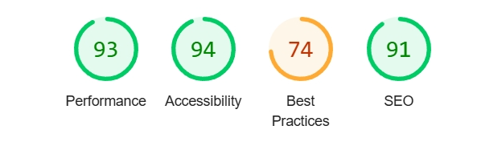|Specifying a specific width and height of my title image, I wanted to retain as much responsivity as I could and opted to use bootstrap instead.|
|All Products Page|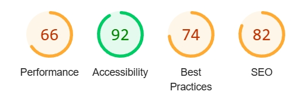|Properly sizing the images would reduce load time and cellular data, currently some images are oversized and are slowing down the time it takes for the page to load.|
|All Clothing|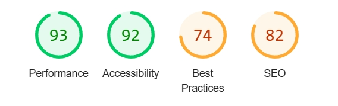|Similar results to the Index page, page is loading well.|
|All Footware|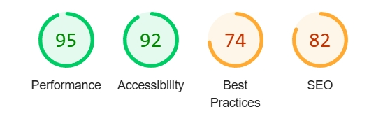|Similar results to the Index page and Sign up page, page is loading well.|
|All Specials|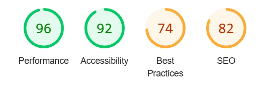|Similar results to the Index page and Sign up page, page is loading well.|
|Sign Up|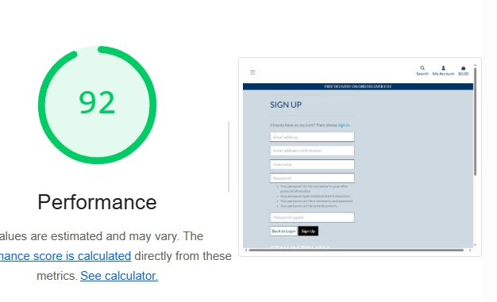|Similar results to the Index page and Sign up page, page is loading well.|
|Login|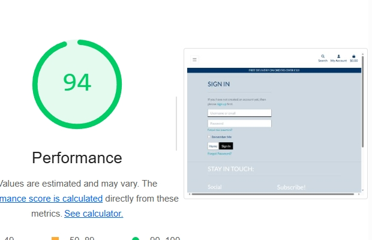|Similar results to the Index page and Sign up page, page is loading well.|
|Mobile|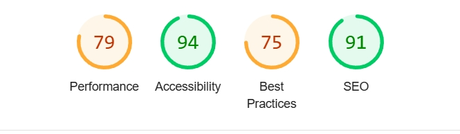|This didn't perform as well as the desktop testing, need to review image sizes and loading times to improve the performance.|

### HTML and CSS Validation <!-- omit in toc -->

### HTML 

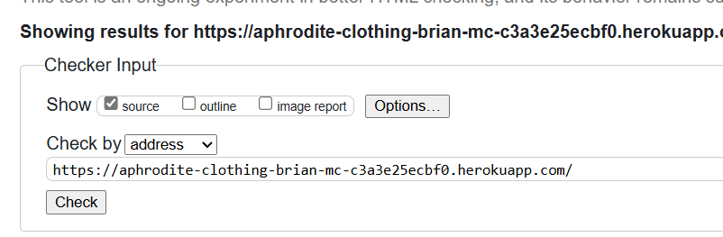

- All of the HTML pages passed the validator however it did raise issues with block content testing. I have inspected the site and it loads and works correctly.

### CSS <!-- omit in toc -->

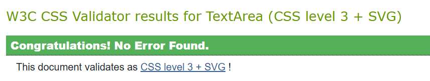

- All pages passed the W3C CSS Validation.

# A11y Color Contrast Accessibility Checker

All website pages were tested using the A11y Color Contrast Accessibility Checker and no automated colour contrast issues were found.

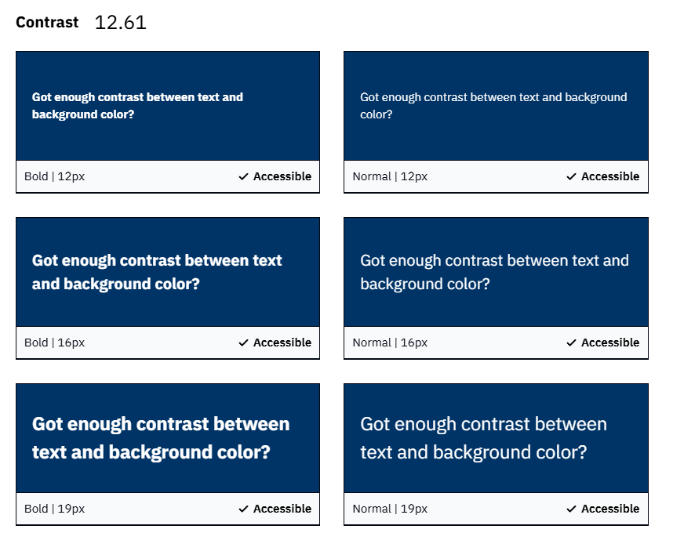

## JavaScript Testing <!-- omit in toc -->

- Throughout development I used console logs to test that the functions worked as intended.

## Python Testing <!-- omit in toc -->

- Throughout I tested in the terminal.

- I valdated my python through the Code Institute Python Linter

## Development Tools <!-- omit in toc -->

- I used my local development tools on my Windows laptop to contuinually check for bugs and performance.

# Peer Review

I asked a number of friends both inside and outside of the Code Institute community for feedback on my project. The feedback on the website and documentation was positive.

It was suggested that I could add additional features to the site, which included links to each restaurant and to edit the styling of the log out navbar.

# Issues

I encountered a number of issues throughout my project, for example, I changed my database on the /admin page on my site, but the changes wouldnt render when pushed to heroku. I had to override the changes and create a db.json file so my database on heroku could find them.

I regularly used Chat GPT and my local AI Gemini on my laptop to help find solutions to my issues.

## Known bugs and fixes

- The checkout page is slow to update, if I had time I would try and alter the load times to speed it up.
- The performance level of the About page needs improving to speed up loading time. This can be fixed at a later date as I did not have time.
- Add extra security in Stripe if this was to be converted to a fully functioning site.
- Need to fix the styling of the Footer as one icon doesnt render properly.
- The Mailchimp could cause users to get spam emails. It is advised not to use it as this site is only for educational purposes.